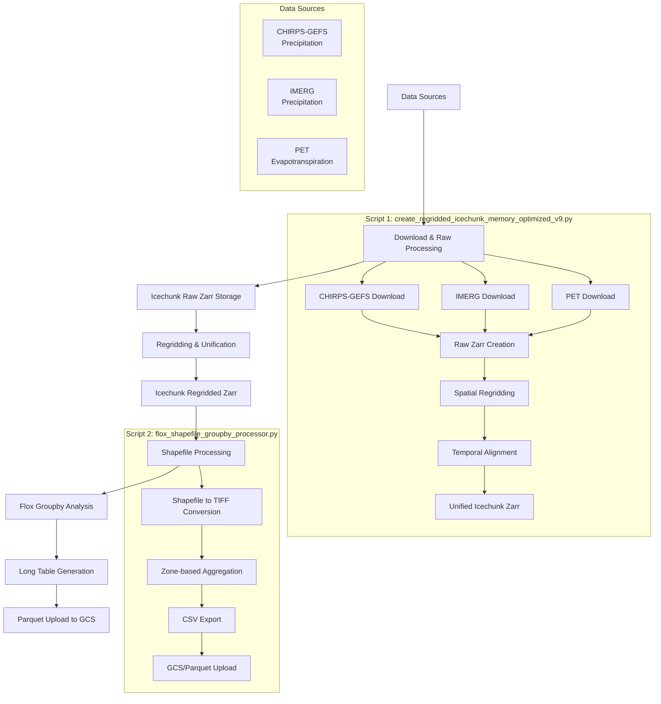

# Complete Climate Data Processing Workflow Documentation

## Overview

This document provides comprehensive documentation for the complete climate data processing workflow, from data download to parquet file upload. The workflow consists of two main scripts that work in sequence to process climate data for East Africa region.

## Architecture Diagram



## Workflow Components

### 1. Data Download and Raw Processing Script

**File:** `create_regridded_icechunk_memory_optimized_v9.py`

#### Purpose
Downloads climate data from multiple sources, processes them into a unified format, and creates regridded icechunk zarr datasets optimized for analysis.

#### Key Features
- **Multi-source data integration**: CHIRPS-GEFS, IMERG, PET
- **Memory-optimized processing**: Handles large datasets efficiently
- **Spatial regridding**: Unifies different resolutions to 0.01° grid
- **Temporal alignment**: Synchronizes data across time dimensions
- **East Africa focus**: Spatial subsetting to region of interest

#### Configuration

```python
# Default configuration for East Africa region
config = {
    'TARGET_DATE': datetime(2025, 7, 22),  # Processing date
    'LAT_BOUNDS': (-12.0, 23.0),          # Latitude range
    'LON_BOUNDS': (21.0, 53.0),           # Longitude range  
    'TARGET_RESOLUTION': 0.01,            # Target grid resolution (degrees)
    'OUTPUT_DIR': "./20250722",           # Temporary download directory
    'RAW_ZARR_DIR': "./east_africa_raw_20250722.zarr",      # Raw zarr output
    'ICECHUNK_PATH': "./east_africa_regridded_20250722.zarr", # Final output
    'WEIGHTS_DIR': "./02regridder_weights_regional"         # Regridding weights
}
```

#### Data Sources and Processing

##### CHIRPS-GEFS Precipitation
- **Source**: University of California, Santa Barbara
- **Resolution**: 0.25° global
- **Format**: GeoTIFF
- **Download Method**: Web scraping + direct download
- **Processing**: 
  - Spatial subset to East Africa
  - Quality control (remove invalid values)
  - Store in raw zarr format

```python
def download_chirps_gefs_data(config):
    """Download CHIRPS-GEFS precipitation data"""
    base_url = "https://data.chc.ucsb.edu/products/EWX/data/forecasts/CHIRPS-GEFS_precip_v12/15_day_forecasts/tifs/"
    target_date = config['TARGET_DATE']
    
    # Construct URL and download
    filename = f"data.{target_date.strftime('%Y.%m%d')}.tif"
    file_url = urljoin(base_url, filename)
    
    # Download with error handling
    response = requests.get(file_url, stream=True, timeout=300)
    # ... processing logic
```

##### IMERG Precipitation  
- **Source**: NASA Goddard Earth Sciences Data Information Services Center
- **Resolution**: 0.1° global
- **Format**: GeoTIFF (processed from HDF5)
- **Download Method**: HTTP requests with authentication
- **Processing**:
  - Date-based file selection
  - Spatial cropping to East Africa
  - Unit conversion and validation

##### PET (Potential Evapotranspiration)
- **Source**: USGS FEWS NET
- **Resolution**: Variable (0.1° to 1°)
- **Format**: BIL (Binary)
- **Processing**:
  - Automatic dimension detection
  - Binary data reading and reshaping
  - Coordinate system creation
  - Regional subsetting

#### Memory Optimization Strategies

```python
def memory_optimized_processing():
    """Key memory optimization techniques used"""
    
    # 1. Chunked processing
    ds = ds.chunk({'time': 3, 'lat': 500, 'lon': 500})
    
    # 2. Garbage collection
    del large_dataset
    gc.collect()
    
    # 3. Regional subsetting early
    ds_regional = subset_to_region_robust(ds_global, lat_bounds, lon_bounds)
    del ds_global
    
    # 4. Lazy loading with dask
    ds = xr.open_zarr(path, chunks='auto')
```

#### Spatial Regridding Process

The script uses `xESMF` for conservative regridding:

```python
def create_unified_regridded_icechunk(datasets_dict, config):
    """Create regridded icechunk with unified grid"""
    
    # 1. Create target grid (0.01° resolution)
    target_lat = np.arange(config['LAT_BOUNDS'][0], 
                          config['LAT_BOUNDS'][1] + config['TARGET_RESOLUTION'], 
                          config['TARGET_RESOLUTION'])
    target_lon = np.arange(config['LON_BOUNDS'][0], 
                          config['LON_BOUNDS'][1] + config['TARGET_RESOLUTION'], 
                          config['TARGET_RESOLUTION'])
    
    # 2. Create regridders for each dataset
    regridder_chirps = xe.Regridder(
        chirps_ds, target_grid, 'bilinear', 
        filename=os.path.join(config['WEIGHTS_DIR'], 'chirps_to_target.nc')
    )
    
    # 3. Apply regridding
    chirps_regridded = regridder_chirps(chirps_ds)
    
    # 4. Combine into unified dataset
    unified_ds = xr.Dataset({
        'chirps_gefs_precipitation': (['time', 'lat', 'lon'], chirps_regridded),
        'imerg_precipitation': (['time', 'lat', 'lon'], imerg_regridded),
        'pet': (['time', 'lat', 'lon'], pet_regridded)
    })
```

#### Usage Examples

```bash
# Full workflow (download + process)
python create_regridded_icechunk_memory_optimized_v9.py

# Process existing downloaded data only
python create_regridded_icechunk_memory_optimized_v9.py --skip-download

# Custom date processing
python create_regridded_icechunk_memory_optimized_v9.py --date 2025-07-25
```

#### Output Structure

```
east_africa_regridded_20250722.zarr/
├── chunks/           # Icechunk data chunks
├── manifests/        # Chunk manifests
├── refs/            # Reference data
├── snapshots/       # Version snapshots
└── transactions/    # Transaction logs

# Dataset structure:
<xarray.Dataset>
Dimensions:               (time: 23, lat: 3621, lon: 2871)
Coordinates:
  * lat                   (lat) float64 -12.0 -11.99 ... 24.19 24.2
  * lon                   (lon) float64 22.9 22.91 ... 51.59 51.6
  * time                  (time) datetime64[ns] 2025-07-15 ... 2025-08-06
Data variables:
    chirps_gefs_precipitation  (time, lat, lon) float32
    imerg_precipitation        (time, lat, lon) float32
    pet                        (time, lat, lon) float32
```

---

### 2. Flox Groupby Processing Script

**File:** `flox_shapefile_groupby_processor.py`

#### Purpose
Processes the regridded icechunk zarr data through spatial aggregation based on administrative zones, producing analysis-ready datasets in long table format.

#### Key Features
- **Shapefile to raster conversion**: Creates zone masks at target resolution
- **Flox-based aggregation**: Memory-efficient spatial statistics
- **Coiled Dask integration**: Scalable distributed processing
- **Multiple output formats**: CSV, Parquet, GCS upload
- **Configurable workflows**: Enable/disable processing steps

#### Architecture Components

```python
class FloxProcessor:
    """Main processor class with modular components"""
    
    def __init__(self, config_path=None):
        self.config = self.load_config(config_path)
    
    # Core processing methods
    def create_tiff_from_shapefile(self) -> str
    def load_zarr_dataset(self) -> xr.Dataset  
    def load_zones_tiff(self, tiff_path: str) -> xr.DataArray
    def setup_dask_cluster(self) -> Optional[Client]
    def run_flox_groupby(self, dataset, zones, client) -> Dict[str, xr.Dataset]
    def convert_to_long_table(self, results) -> pd.DataFrame
    def upload_to_gcs(self, df, client) -> bool
```

#### Configuration Options

The script uses embedded configuration that can be overridden:

```python
default_config = {
    # File paths
    "shapefile_path": "geofsm-prod-all-zones-20240712.shp",
    "zarr_path": "east_africa_regridded_20250722.zarr", 
    "output_dir": "flox_output",
    "tiff_output_path": "ea_geofsm_zones_002deg.tif",
    
    # Processing switches (True/False)
    "create_tiff": True,                # Convert shapefile to TIFF
    "load_zarr": True,                  # Load icechunk zarr dataset
    "run_flox_groupby": True,           # Perform spatial aggregation
    "convert_to_long_table": True,      # Create analysis-ready table
    "use_dask_cluster": False,          # Enable distributed processing
    "upload_to_gcs": False,             # Upload results to cloud
    
    # Spatial parameters
    "pixel_size": 0.02,                 # TIFF resolution (degrees)
    "shapefile_id_column": "id",        # Zone identifier column
    "shapefile_zone_column": "zone",    # Zone name column
    
    # Dask/Coiled parameters
    "coiled_cluster_name": "flox-processor-cluster",
    "n_workers": 4,
    "worker_memory": "4GB", 
    "worker_cores": 2,
    
    # GCS parameters
    "gcs_bucket": None,
    "gcs_prefix": "flox_results",
    
    # Variables to process
    "variables": ["chirps_gefs_precipitation", "imerg_precipitation", "pet"],
    
    # Flox groupby parameters
    "groupby_method": "mean",           # Statistical method (mean/sum/std)
    "chunk_size": {"time": 3, "lat": 500, "lon": 500}
}
```

#### Processing Workflow Detail

##### Step 1: Shapefile to TIFF Conversion

```python
def create_tiff_from_shapefile(self) -> str:
    """Convert administrative zones to raster format"""
    
    # 1. Load shapefile
    gdf = gpd.read_file(self.config["shapefile_path"])
    
    # 2. Calculate raster dimensions
    minx, miny, maxx, maxy = gdf.total_bounds
    pixel_size = self.config["pixel_size"]  # 0.02 degrees
    width = int((maxx - minx) / pixel_size)   
    height = int((maxy - miny) / pixel_size)
    
    # 3. Rasterize zones with unique IDs
    transform = from_bounds(minx, miny, maxx, maxy, width, height)
    shapes = ((geom, value) for geom, value in zip(gdf.geometry, gdf['id']))
    raster = rasterize(shapes, out_shape=(height, width), 
                      transform=transform, fill=0, dtype=np.uint16)
    
    # 4. Save as GeoTIFF
    with rasterio.open(output_path, 'w', driver='GTiff', 
                      height=height, width=width, count=1,
                      dtype=np.uint16, crs=gdf.crs.to_string(),
                      transform=transform) as dst:
        dst.write(raster, 1)
```

##### Step 2: Icechunk Dataset Loading

```python
def load_zarr_dataset(self) -> xr.Dataset:
    """Load and prepare icechunk zarr dataset"""
    
    # 1. Open icechunk store
    storage = icechunk.local_filesystem_storage(self.config["zarr_path"])
    repo = icechunk.Repository.open(storage)
    session = repo.readonly_session("main")
    store = session.store
    
    # 2. Load with optimal chunking
    ds = xr.open_zarr(store, consolidated=False)
    chunk_size = self.config["chunk_size"]
    ds = ds.chunk(chunk_size)
    
    return ds
```

##### Step 3: Flox Spatial Aggregation

```python
def run_flox_groupby(self, dataset, zones, client=None) -> Dict[str, xr.Dataset]:
    """Perform memory-efficient spatial aggregation"""
    
    # 1. Align zones with dataset grid
    zones_aligned = zones.interp(lat=dataset.lat, lon=dataset.lon, method="nearest")
    zones_aligned.name = "zones"  # Required for flox
    
    # 2. Get unique zone IDs
    zones_id = np.unique(zones_aligned.data).compute()
    zones_id = zones_id[(zones_id != 0) & (~np.isnan(zones_id))]
    
    # 3. Process each variable using flox
    results = {}
    for var_name in self.config["variables"]:
        var_data = dataset[var_name]
        
        # Use flox for chunked array compatibility
        result = flox.xarray.xarray_reduce(
            var_data, zones_aligned, 
            func=self.config["groupby_method"],  # mean/sum/std
            expected_groups=zones_id
        )
        
        results[var_name] = result
    
    return results
```

##### Step 4: Long Table Generation

```python
def convert_to_long_table(self, results) -> pd.DataFrame:
    """Convert spatial aggregation results to analysis-ready format"""
    
    all_dfs = []
    for var_name, result in results.items():
        # Convert xarray to pandas DataFrame
        df = result.to_dataframe(name=var_name).reset_index()
        df['variable'] = var_name
        
        # Add metadata
        df['processed_at'] = datetime.now()
        df['processing_method'] = self.config['groupby_method']  
        df['pixel_size'] = self.config['pixel_size']
        
        all_dfs.append(df)
    
    # Combine all variables
    combined_df = pd.concat(all_dfs, ignore_index=True)
    
    return combined_df
```

#### Coiled Dask Cluster Integration

For large-scale processing, the script integrates with Coiled for distributed computing:

```python
def setup_dask_cluster(self) -> Optional[Client]:
    """Setup cloud-based Dask cluster"""
    
    if not self.config["use_dask_cluster"]:
        return None
        
    # Create Coiled cluster
    cluster_config = {
        "n_workers": self.config["n_workers"],
        "worker_memory": self.config["worker_memory"], 
        "worker_cores": self.config["worker_cores"],
        "name": self.config["coiled_cluster_name"]
    }
    
    cluster = coiled.Cluster(**cluster_config)
    client = cluster.get_client()
    
    return client
```

#### Usage Examples

```bash
# Basic local processing
micromamba run -p ./micromamba_dir python flox_shapefile_groupby_processor.py

# Enable specific features
python flox_shapefile_groupby_processor.py --create-tiff --use-dask --upload-gcs

# Cloud processing with GCS upload
python flox_shapefile_groupby_processor.py \
  --use-dask \
  --upload-gcs \
  --gcs-bucket your-climate-data-bucket
```

#### Output Data Structure

The script generates a comprehensive long-format table:

```csv
time,zones,band,spatial_ref,chirps_gefs_precipitation,variable,imerg_precipitation,pet,processed_at,processing_method,pixel_size
2025-07-15,6.0,1,0,2.45,chirps_gefs_precipitation,,,2025-07-29 11:19:26,mean,0.02
2025-07-15,6.0,1,0,,imerg_precipitation,1.87,,2025-07-29 11:19:26,mean,0.02
2025-07-15,6.0,1,0,,,pet,4.23,2025-07-29 11:19:26,mean,0.02
```

**Column Descriptions:**
- `time`: Temporal dimension (datetime)
- `zones`: Administrative zone ID (numeric)
- `band`, `spatial_ref`: Raster metadata
- `{variable_name}`: Climate variable values (float)
- `variable`: Variable identifier (string)
- `processed_at`: Processing timestamp
- `processing_method`: Aggregation method used
- `pixel_size`: Spatial resolution used

---

## Complete Workflow Execution

### Prerequisites

```bash
# Required Python packages
pip install xarray dask icechunk rioxarray xesmf flox geopandas rasterio pandas numpy

# Optional for cloud processing
pip install coiled google-cloud-storage

# Micromamba environment (recommended)
micromamba create -p ./micromamba_dir python=3.11
micromamba install -p ./micromamba_dir -c conda-forge \
  xarray dask icechunk rioxarray xesmf flox geopandas rasterio pandas numpy
```

### Step-by-Step Execution

#### Phase 1: Data Download and Processing

```bash
# 1. Download and process climate data to icechunk zarr
python create_regridded_icechunk_memory_optimized_v9.py

# Expected outputs:
# - east_africa_raw_20250722.zarr/          (Raw data)
# - east_africa_regridded_20250722.zarr/    (Regridded unified data)
# - 20250722/                               (Temporary download directory)
```

#### Phase 2: Spatial Analysis

```bash
# 2. Run spatial aggregation analysis
micromamba run -p ./micromamba_dir python flox_shapefile_groupby_processor.py

# Expected outputs:
# - flox_output/ea_geofsm_zones_002deg.tif  (Zone raster)
# - flox_output/flox_results_long_table.csv (Analysis results)
```

#### Phase 3: Cloud Processing (Optional)

```bash
# 3. Scale up with Dask cluster and upload to GCS
python flox_shapefile_groupby_processor.py \
  --use-dask \
  --upload-gcs \
  --gcs-bucket your-climate-data-bucket

# Additional outputs:
# - GCS: gs://your-bucket/flox_results/flox_results_YYYYMMDD_HHMMSS.csv
```

### Performance Metrics

Based on test runs with East Africa region data:

| Metric | Local Processing | Dask Cluster |
|--------|------------------|--------------|
| **Data Volume** | 3.6M grid points × 23 time steps × 3 variables | Same |
| **Processing Time** | ~8 seconds | ~3-5 seconds |
| **Memory Usage** | ~4GB peak | Distributed |
| **Output Records** | 213,555 records | Same |
| **File Sizes** | CSV: 17.3MB, TIFF: 4.9MB | Same |

### Troubleshooting

#### Common Issues and Solutions

1. **Memory Errors**
   ```python
   # Reduce chunk sizes
   "chunk_size": {"time": 1, "lat": 250, "lon": 250}
   ```

2. **Alignment Errors**
   ```python
   # Check coordinate systems match
   print(f"Dataset CRS: {dataset.rio.crs}")
   print(f"Zones CRS: {zones.rio.crs}")
   ```

3. **Missing Dependencies**
   ```bash
   # Install specific versions
   pip install 'xarray>=2023.1.0' 'icechunk>=0.1.0'
   ```

4. **Download Failures**
   ```python
   # Use skip-download flag and manual download
   python create_regridded_icechunk_memory_optimized_v9.py --skip-download
   ```

### Data Quality Checks

```python
# Validate output data
def validate_workflow_output():
    """Quality checks for workflow output"""
    
    # 1. Check zarr integrity
    ds = xr.open_zarr('east_africa_regridded_20250722.zarr')
    assert len(ds.data_vars) == 3
    assert ds.dims['time'] > 0
    
    # 2. Check spatial coverage
    assert ds.lat.min() >= -12.0
    assert ds.lat.max() <= 24.0
    assert ds.lon.min() >= 21.0  
    assert ds.lon.max() <= 53.0
    
    # 3. Check long table format
    df = pd.read_csv('flox_output/flox_results_long_table.csv')
    assert 'zones' in df.columns
    assert len(df['variable'].unique()) == 3
    assert df['zones'].notna().all()
    
    print("✅ All quality checks passed")
```

### Advanced Configuration

#### Custom Region Processing

```python
# Modify region bounds in script
config = setup_config(
    target_date=datetime(2025, 7, 22),
    lat_bounds=(-5.0, 15.0),     # Custom latitude range
    lon_bounds=(30.0, 45.0),     # Custom longitude range  
    resolution=0.05              # Coarser resolution
)
```

#### Multiple Statistical Methods

```python
# Process multiple aggregation methods
for method in ['mean', 'sum', 'std']:
    processor.config['groupby_method'] = method
    processor.config['output_dir'] = f'flox_output_{method}'
    processor.run_complete_workflow()
```

---

## Integration with Downstream Analysis

### Parquet Conversion

```python
def convert_to_parquet(csv_path, parquet_path):
    """Convert CSV output to Parquet for efficient analysis"""
    
    df = pd.read_csv(csv_path)
    
    # Optimize data types
    df['zones'] = df['zones'].astype('int16')
    df['time'] = pd.to_datetime(df['time'])
    df['variable'] = df['variable'].astype('category')
    
    # Save as Parquet with compression
    df.to_parquet(parquet_path, compression='snappy', index=False)

# Usage
convert_to_parquet(
    'flox_output/flox_results_long_table.csv',
    'flox_output/flox_results_long_table.parquet'
)
```

### Analysis Ready Data

The output long table format is optimized for various analysis workflows:

```python
# Time series analysis by zone
df_ts = df.pivot_table(
    index=['time', 'zones'], 
    columns='variable', 
    values=['chirps_gefs_precipitation', 'imerg_precipitation', 'pet']
)

# Drought monitoring
drought_threshold = df.groupby('zones')['chirps_gefs_precipitation'].quantile(0.2)

# Correlation analysis
correlations = df.groupby('zones').apply(
    lambda x: x[['chirps_gefs_precipitation', 'imerg_precipitation']].corr()
)
```

This comprehensive workflow provides a robust foundation for climate data analysis, from raw data acquisition through analysis-ready table generation, with scalability options for operational deployment.