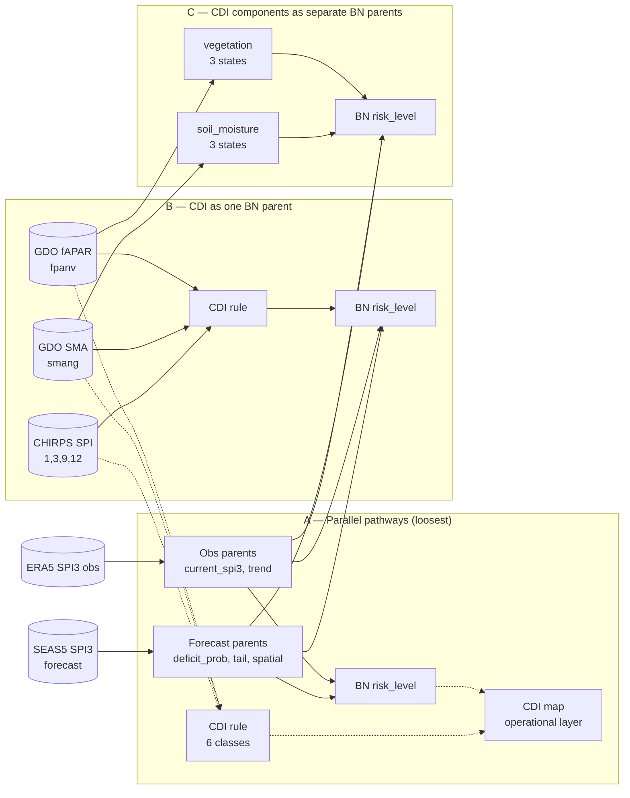
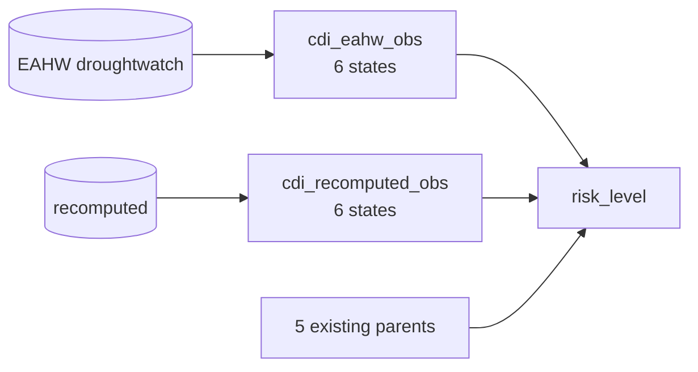

# Integrating EU JRC CDI with the Drought BN — design plan

This page lays out three concrete paths for combining the
JRC-style **Combined Drought Indicator (CDI)** with the existing
forecast-driven Drought BN. The CDI formulation is the
14-class convergence-of-evidence rule from
`drought_crma/cdi-method.md`; the BN is `drought_bn_ibf_v1.jl`
(5-parent → risk_level → CRMA, plus per-member storyline).

The two systems answer **different operational questions**, so the
right answer is to keep both — the question is whether the
CDI components should feed the BN as additional parent nodes,
or stay as a parallel deterministic pathway, or both.

---

## 1. The CDI rule (recap from `cdi-method.md`)

Seven boolean inputs, deterministic 14-class output:

```
SPI9_12 < -1   long-term precipitation deficit
SPI3   < -1   medium-term precipitation deficit
SPI1   < -2   short-term (very dry month)
SPI3_prev < -1   medium-term deficit in the previous step (recovery flag)
SPI1_prev < -2   short-term deficit in the previous step
SMA    < -1   soil-moisture anomaly (root-zone, GDO `smang`)
fAPAR  < -1   vegetation anomaly (GDO `fpanv`)
```

Maps to 6 named levels, colour-coded:

```
Watch              precipitation deficit only            (#FFFF00 yellow)
Warning            + soil moisture deficit               (#FFA600 orange)
Alert              + vegetation anomaly                  (#FE0000 red)
Partial recovery   meteo back to normal, vegetation not  (#9F8001 brown)
Full recovery      both meteo and vegetation recovered   (#9EC75F green)
No drought         all conditions absent                 (#F5F5F5 grey)
```

The 14 numbered classes within those 6 levels distinguish *combinations*
of inputs (e.g. Watch class 1 = `SPI1<-2` only; Alert class 10 = all
four meteo+SMA+fAPAR conditions firing). The full table and
`calculate_cdi(...)` reference function are in
`drought_crma/cdi-method.md`.

---

## 2. Data on source.coop

Verified anonymous-readable (from this VM):

| Role | icechunk slab | pencil zarr | dims | time | grid |
|---|---|---|---|---|---|
| CHIRPS SPI{1,3,6,9,12,24,48} | `chirps_spi_icechunk` | `chirps_spi_pencil_zarr` | (time, lat, lon) per SPI variable | 1991-01..2026-02 (422 monthly) | 800 × 690 |
| GDO SMA (`smang`) | `gdo_sma_icechunk` | `gdo_sma_pencil_zarr` | (time, lat, lon) | 1995-01..2026-03 (1131 dekadal) | 800 × 690 |
| GDO fAPAR (`fpanv`) | `gdo_fpar_icechunk` | `gdo_fpar_pencil_zarr` | (time, lat, lon) | 2012-01..2026-03 (516 dekadal) | 480 × 414 |

Source ETL: `ibf-thresholds-triggers/thresholds/hf-gdo/{chirps_spi,gdo_sma,gdo_fpar}_icechunk.py`.

**Key alignment items**:
- **Cadence mismatch**: CHIRPS SPI is monthly, GDO is dekadal (10-day).
  For monthly BN runs we need to aggregate dekadal to monthly. Conventions
  used in JRC: take the **last dekad of the month** for the monthly
  snapshot, OR average the three dekads (gives a smoother signal but
  blurs the convergence test). Default to "last dekad" to match JRC EDO.
- **Grid mismatch**: SPI/SMA at 800 × 690 (~5 km), fAPAR at 480 × 414
  (~10 km). Need to regrid one to the other before pixel-AND of the
  CDI conditions. Bilinear, with fAPAR on the SPI/SMA grid.
- **Coverage mismatch**: fAPAR starts 2012, SMA starts 1995, SPI starts
  1991. Pre-2012 we cannot evaluate Alert / Partial-recovery /
  Full-recovery (fAPAR-dependent classes) — only Watch / Warning.
  This is fine for forward-looking IBF (we are in 2026) but limits
  hindcast validation.

---

## 3. Three integration paths



### Path A — parallel pathways (no BN change)

- Compute CDI map per month using the 14-class rule, exactly per
  `cdi-method.md`.
- Compute BN risk map per month using the existing 5-parent BN.
- Display **both** layers side by side in the operational dashboard;
  CDI tells you "what *is* happening on the ground based on
  ohydrologic + vegetation evidence", BN tells you "what *will*
  happen 1-6 months ahead given the forecast".
- **Pros**: no BN refit, deterministic CDI is auditable for partners
  who need rule-based outputs (FAO/JRC EDO consumers expect this);
  zero risk of double-counting.
- **Cons**: leaves the analyst to do the convergence in their head.
  No probabilistic combination of "obs already shows Alert" with
  "forecast says next month is Severe".

### Path B — CDI as a single BN parent

- Pre-compute CDI per pixel (14 classes) with `calculate_cdi(...)`.
- Aggregate to per-boundary CDI level by **mode** (most common
  class) or by **max severity** (the worst class touching the
  boundary, weighted by area).
- Add as one new parent `cdi_obs` to the BN with 6 states
  (Watch / Warning / Alert / Partial_recovery / Full_recovery /
  No_drought).
- Feed via the same virtual-evidence channel as the other parents:
  `cdi_obs_data ~ DiscreteTransition(cdi_obs, I_6)`.
- New CPT slice: `risk_level | cur, def, spa, trn, tail, cdi_obs`
  size 5 × 5 × 5 × 3 × 3 × 4 × **6** = **27,000 combinations**.

  In practice we'd encode `cdi_obs`'s contribution as a *modifier*
  on `base_risk` (same pattern as `tail`):

  ```julia
  # In compute_risk_probs(...)
  cdi_modifier = (No_drought=0.0, Watch=+0.15, Warning=+0.35,
                  Alert=+0.60, Partial_recovery=-0.05,
                  Full_recovery=-0.20)
  ```

  plus expert rules like "Alert + Deteriorating + Forecast deficit
  ≥ Medium → almost-certainly Extreme".
- **Pros**: one new parent ⇒ minimal CPT growth; `cdi_obs` is a
  pre-validated convergence signal so the BN gets a strong
  observational anchor; CDI's recovery classes can *de-stress* the
  BN in months where forecasts overcall (rule 4 `[0.65, 0.30,
  0.05, 0, 0]` extension).
- **Cons**: the 14-class CDI compresses to 6 levels in the BN,
  losing the within-level information. Operationally fine for
  trigger decisions, but stat-significance testing of the
  individual classes becomes harder.

### Path C — CDI components as three separate BN parents

- Drop the deterministic CDI rule; instead add **`soil_moisture`**
  (3 states from SMA: Dry / Normal / Wet by SMA bins ±1) and
  **`vegetation`** (3 states from fAPAR: Anomaly / Normal / Above)
  as new parents.
- Total parent count rises from 5 to 7 (`cur, def, spa, trn, tail,
  soil_moisture, vegetation`). RxInfer's `DiscreteTransition`
  exact-rules cap at 5 conditioning parents, so we'd fall back to
  the legacy matmul path (already supported via `--legacy-inference`).
- CPT size: 5 × 5 × 3 × 3 × 4 × 3 × 3 = **8,100 combinations**.
- **Pros**: the BN learns the convergence weights itself; soft
  evidence on each component handles measurement uncertainty
  (gamma-fit noise on SPI, fAPAR retrieval noise) the JRC rule
  treats as hard cutoffs.
- **Cons**: BN no longer producible by RxInfer's tensor-rule path
  (see flood README's `--legacy-inference` note); 8,100-cell CPT
  needs careful expert-rule construction; loses the JRC-name-
  recognised CDI labels that operational consumers ask for.

---

## 4. Recommended path: **Path B (BN integration)**

> **Note on Path A**: ICPAC already operates a public CDI product —
> the **East Africa Hazard Watch** dekadal NetCDFs at
> `https://droughtwatch.icpac.net/ftp/dekadal/netcdf/`, in production
> since 2010 and aligned with JRC EDO methodology. The deterministic
> "CDI as a layer" question is already solved upstream; we don't
> need to reproduce it as the operational product. Any
> `cdi_data_prep.py` we write internally is therefore a
> **cross-validation utility** (does our `calculate_cdi(...)` over
> the source.coop CHIRPS SPI / GDO SMA / GDO fAPAR pencil stores
> agree with the published droughtwatch raster?), not the
> publishable CDI layer itself.

The remaining question — and the way forward — is **Path B**: feed
the boundary-level CDI class into the BN as an evidence/parent node
so the forecast-driven risk posterior is *anchored* by the
on-the-ground convergence-of-evidence signal that the JRC rule
captures.

This is a low-risk extension because:
- CDI is computed deterministically and is not itself a source
  of new uncertainty injected into the BN.
- Adding one parent grows the CPT from 1,800 to 10,800 cells
  (with `--no-agreement`) — RxInfer's exact rules still apply
  (the cap is 5 *conditioning* parents = our existing 5; CDI
  replaces or augments one of them; see "Compatibility" below).
- We can ingest the **published droughtwatch CDI directly** as
  the source of truth for `cdi_obs`, and use a thin
  `cdi_data_prep.py` (built on `calculate_cdi`) only for
  back-validation and for forward-looking dekads that aren't yet
  on the FTP.

**Path C** is interesting research but premature. The JRC convergence-
of-evidence rules are well-validated; reproducing them via a learned
CPT in 8,100 cells would require a labelled training set we don't
have.

---

## 5. Implementation plan (Path B)

### 5a. CDI ingestion — two sources, same schema

**Primary (operational)**: ingest the published droughtwatch CDI
NetCDF directly. The dekadal files at
`https://droughtwatch.icpac.net/ftp/dekadal/netcdf/` are the
authoritative product; reading them keeps the BN aligned with what
ICPAC publishes externally.

```
Inputs:
  - droughtwatch CDI NetCDF (latest dekad covering target month D)
  - icpac_adm1v3.geojson

Per target month D:
  1. Pick the dekad in droughtwatch matching D (last dekad of the month
     by default — matches JRC EDO convention).
  2. Open the NetCDF lazily; the variable is a per-pixel CDI class
     (1..14 or already a level enum, depending on the FTP product
     version — check by var name and attributes).
  3. Map class → level using the same `cdi-method.md` table (or
     verify the level is already encoded).
  4. Per admin-1:
     - cdi_max_severity   = worst class touching the boundary
     - cdi_level          = level corresponding to cdi_max_severity
     - cdi_level_fraction = fraction of pixels in that level
     - cdi_modal_class    = mode over pixels (diagnostic)
  5. Write columns to a sidecar CSV `cdi_inputs_YYYY-MM.csv`
     (joined on `id` to the BN prep CSV) or merge directly into
     `drought_inputs_YYYY-MM.csv`.
```

**Secondary (cross-validation + forward-looking)**: a thin
`cdi_data_prep.py` that recomputes CDI from the source.coop
component stores using the `calculate_cdi(...)` reference function:

```
Inputs (all anonymous reads from source.coop):
  - chirps_spi_icechunk  (spi1, spi3, spi9, spi12; pick spi9 or spi12 for "long")
  - gdo_sma_icechunk     (smang; aggregate dekads → monthly: last-dekad)
  - gdo_fpar_icechunk    (fpanv; same)
  - icpac_adm1v3.geojson

Per target month D:
  1. Load CHIRPS SPI{1,3,9 or 12} for D and D−1.
  2. Load SMA, fAPAR for D's last dekad and D−1's last dekad.
  3. Regrid all to a common 5 km grid (the SPI/SMA grid; bilinear-resample fAPAR).
  4. Per pixel:
     - cond_spi9_12 = SPI9 (or SPI12) < -1
     - cond_spi3    = SPI3 < -1
     - cond_spi1    = SPI1 < -2
     - cond_spi3_prev, cond_spi1_prev (D−1)
     - cond_sma     = smang < -1
     - cond_fapar   = fpanv < -1
     - cdi_class, cdi_level = calculate_cdi(...)  # from cdi-method.md
  5. Per admin-1: same aggregation as the droughtwatch path.
  6. Validation step: compare droughtwatch CDI vs. recomputed CDI
     per boundary; flag any boundary where the two disagree by
     ≥ 1 CDI level. This is a one-off audit before depending on
     the recomputation for forward dekads not yet on the FTP.
```

Reuse: `build_mask`, `regrid_to`, `zonal_reduce`,
`fill_small_boundaries` from `drought_data_prep.py`.

The two paths produce the **same schema**, so the BN reads from
either interchangeably; the operational pipeline pulls from
droughtwatch first and falls back to the recomputation only when
the FTP file for the target dekad is missing.

### 5b. BN extension — `drought_bn_ibf_v1.jl`

Two-line addition to `STATES`:

```julia
const CDI_STATES = ["No_drought", "Full_recovery", "Partial_recovery",
                    "Watch", "Warning", "Alert"]   # increasing-stress order
```

`compute_risk_probs(c, d, s, t, agr, tail, cdi=1)` becomes a 6-arg
function. The cdi modifier slots in next to the tail modifier:

```julia
# After base_risk += tail_modifier
if cdi == 6      # Alert
    base_risk += 0.55
elseif cdi == 5  # Warning
    base_risk += 0.30
elseif cdi == 4  # Watch
    base_risk += 0.10
elseif cdi == 2  # Full_recovery — partial de-stress
    base_risk -= 0.15
end
# (Partial_recovery and No_drought leave base_risk unchanged)
```

Two new expert rules (added to the existing 8):

```julia
# C1: CDI Alert + Forecast High deficit → certain Extreme drought
elseif cdi >= 6 && d >= 4
    [0.0, 0.0, 0.0, 0.20, 0.80]

# C2: CDI Full_recovery + Improving + Above_Normal → confidently Minimal
elseif cdi == 2 && t == 0 && c == 0
    [0.85, 0.15, 0.0, 0.0, 0.0]
```

CSV reader picks up the new `cdi_*` columns; if missing, falls back
to a uniform `cdi_obs` prior so the existing BN runs continue to
work unchanged. Soft-evidence column prefix: `cdi_p1..cdi_p6`.

### 5c. Plotting

`plot_drought_bn_choropleth.py` already takes a glob; a sister
`plot_cdi_choropleth.py` with the JRC colour palette
(`#FFFF00 / #FFA600 / #FE0000 / #9F8001 / #9EC75F / #F5F5F5`) gives
the operational layer alongside the BN-CRMA traffic light.

### 5d. Calibration

The two new modifier weights and two expert rules above are first-
pass values. Calibrate against:
- Historical 2010-11, 2016-17, 2020-22 Horn-of-Africa events
  (CDI Alert classes should align with the BN's High/Extreme
  classifications).
- JRC EDO bulletins for cross-validation (their CDI maps are
  publicly archived).

---

## 5e. EAHW droughtwatch → icechunk store

The FTP NetCDFs at `https://droughtwatch.icpac.net/ftp/dekadal/netcdf/`
are dekadal files with one variable each — fast enough for a single
month, slow if we want a hindcast across all dekads since 2010 (~ 600
files). A one-time `eahw_cdi_to_icechunk.py` builds an icechunk store
on source.coop with the same access ergonomics as
`era5_ecmwf_pencil` / `chirps_spi_icechunk`:

```
INPUT  : the ~600 dekadal NetCDFs from droughtwatch (cdi_YYYYMMDD.nc)
OUTPUT : s3://us-west-2.opendata.source.coop/e4drr-project/
                observations/eahw_cdi_icechunk
SCHEMA :
  dims:    (time, lat, lon)
  vars:    cdi_class    int8      1..14 per cdi-method.md
           cdi_level    int8      1..6  encoded (1=No_drought, ...,
                                                 4=Watch, 5=Warning,
                                                 6=Alert)
           # leave the JRC level integer in a coord attr so the
           # mapping is self-describing
  chunks:  slab (1, full_lat, full_lon) — same access pattern as
           the SEAS5 SPI3 slab store: per-dekad zonal aggregation
           is the dominant query
```

Build pattern mirrors `download_seas51_tp_to_icechunk.py`'s init+fill:
- Init template with the full time dim (one entry per published dekad)
- Fill per dekad — region write per `time` slice, single commit
- `--resume` flag to skip already-filled dekads (for incremental
  weekly updates as new EAHW files appear on the FTP)

Once published, the `cdi_ingest_droughtwatch.py` script reduces to
the same anonymous-icechunk-read pattern as
`drought_data_prep.py` for ERA5 SPI3 — a few seconds per month
instead of an HTTP round-trip per file.

## 5f. Multi-source CDI evidence — fallback chain vs. two parent nodes

You raised the right question: with **two** sources of CDI (the
published EAHW and the recomputed-from-components), should they
feed the BN as **two parents**, **one parent with source priority**,
or **gracefully fall back when missing**?

The Bayesian-network answer is *all three are valid, but they encode
different beliefs about how the two sources relate*. Picking
between them changes how confident the posterior is when the two
agree, and how the posterior diffuses when one is absent.

### Option α — one `cdi_obs` node with a source-priority chain

Data prep picks one source per boundary in this order:

```
1. EAHW droughtwatch  (preferred — published, validated, JRC-aligned)
2. Recomputed CDI     (fallback — calculate_cdi() over CHIRPS+SMA+fAPAR)
3. missing            (BN marginalises, posterior reverts to the other
                       5 parents — the existing forecast + ERA5 SPI3
                       obs path runs unchanged)
```

The BN graph stays at 6 parents (5 existing + `cdi_obs`). When all
sources are missing, `cdi_data` carries `missing` rather than a
probability vector and RxInfer's `DiscreteTransition` channel
becomes a no-op — exactly the "BN acts as a belief update with
available evidence" behaviour you want.

A `cdi_source` diagnostic column (`eahw` / `recomputed` /
`missing`) goes into the prep CSV so we can audit which source
each posterior was anchored on.

**This is the recommended starting point** because it is the
simplest extension and avoids the double-counting trap below.

### Option β — two parents `cdi_eahw_obs` and `cdi_recomputed_obs`



Each can be `missing` independently; when **both** are present they
contribute *both* to the posterior.

This looks attractive — extra evidence usually helps — but there is
a **double-counting trap**: the two CDI sources are **not
independent**. They are computed from the same physical CHIRPS
precipitation + GDO SMA + GDO fAPAR data, just with different
processing chains. In a strict BN, two parents that share an
unobserved ancestor double-count the shared signal unless we model
the dependency explicitly.

When EAHW and recomputed *agree*, this is the desired behaviour:
strong evidence → tighter posterior. When they *disagree*, the
two-parent structure makes the BN strangely overconfident in
*both* states at once and the posterior diffuses harder than it
should. The flag bit you actually want — "the two sources
disagree, so be less confident" — is lost.

### Option γ — one `cdi_obs` node, soft evidence encodes source agreement

Hybrid of α and β. Data prep:

```
if both available:
    if eahw == recomputed:                     # confident
        cdi_p[level] = 1.0                      # one-hot at the level
    else:                                       # disagreement
        cdi_p[eahw_level]      = 0.5
        cdi_p[recomputed_level] = 0.5            # split mass
elif only one available:
    cdi_p[available_level] = 0.95               # slight haircut
    everywhere else        = 0.05/(K-1)
else:
    cdi_p = uniform                             # no evidence ⇒ no-op
```

This gives the BN a *probability vector* on `cdi_obs` instead of a
one-hot, and the existing soft-evidence path (already wired up
through `cdi_p1..cdi_p6`) does the right thing. Source-disagreement
becomes uncertainty in the evidence channel, which is the
mathematically clean way to express it.

### Option δ (research) — noisy-channel two-parent structure

Add a hidden `cdi_true` node with the two observed CDI's as its
*children* (not its parents):

```
            cdi_true (hidden, 6 states)
              ├── cdi_eahw_obs        (observation noise CPT)
              └── cdi_recomputed_obs  (observation noise CPT)
              └── risk_level          (one of risk_level's parents)
```

`cdi_true` is what the BN actually conditions on. The two observed
nodes have CPTs of the form P(observed | cdi_true) that encode
each source's measurement noise. This is the textbook structure
for "two noisy measurements of the same latent quantity" and
correctly handles disagreement without double-counting.

The cost: introduces inference over a hidden node, which the
RxInfer message-passing engine can do but the direct-matmul path
cannot (a few extra weight tensors needed). Worth pursuing as a
v2 once the simpler design is in production.

### Recommendation

- **Now (Path B-α)**: one `cdi_obs` parent, source-priority chain
  EAHW → recomputed → missing, plus a `cdi_source` diagnostic
  column. Same 6-parent CPT in the BN. Graceful degradation when
  any/all CDI sources are missing.
- **Soon (Path B-γ)**: upgrade the data-prep step so `cdi_obs`
  consumes a *probability vector* instead of a one-hot when the
  two sources are present and disagree — encoding source-agreement
  as evidence-channel certainty. No BN code change.
- **Later (Path B-δ)**: the noisy-channel structure with a hidden
  `cdi_true` node, once we have enough cross-source disagreement
  data to fit the per-source noise CPT.

The phrase you used — "the BN acts as a belief update with
available evidence" — is *exactly* what virtual-evidence channels
provide for free in RxInfer. Soft-marginalising over a `missing`
observation is a one-line change in the @model. We do not need
custom logic for "if both missing, fall back to ERA5 SPI3 obs" —
the BN already does that, because `current_spi3` is one of the
remaining 5 parents and continues to be observed normally.

## 6. Compatibility with existing engines

| Path | RxInfer exact-rules path | matmul fallback |
|------|---|---|
| A only | ✅ unchanged | ✅ |
| A + B (CDI as 1 extra parent) | ⚠️ 6 parents — exceeds the 5-cap for `DiscreteTransition`; need `--legacy-inference` OR make `cdi_obs` and `forecast_agreement` mutually exclusive (only one active at a time) | ✅ |
| C (3 extra parents) | ❌ 8 parents | ✅ |

**Pragmatic fix for A+B**: keep the existing `--no-agreement` flag
as the default operational path; CDI takes the 5th-parent slot
that `forecast_agreement` would have used. The two never both
appear in the same RxInfer call, so the 5-parent rule cap is
respected. `--legacy-inference` remains available for users who
want both.

---

## 7. What this unlocks for analysts

- **CDI Alert + BN Actionable_Risk**: highest-confidence signal —
  current observations *and* forward forecasts both stress.
  Trigger anticipatory action without further deliberation.
- **CDI Watch + BN Actionable_Risk**: forecast-leading —
  ground-truth not yet flagged, but model says it's coming;
  prepare logistics but consider waiting for CDI Warning before
  cash-out.
- **CDI Alert + BN Monitor**: backwards diverging — drought is
  here but model expects recovery; investigate forecast skill
  (which lead month? which member?) before acting on the
  optimistic signal.
- **CDI Full_recovery + BN Monitor**: end-of-event signal —
  consider closing the active operation.

The 4-cell co-occurrence matrix becomes a richer decision aid
than either layer alone.

---

## 8. Open design questions (for the team)

1. **Aggregation rule for boundary-level CDI**: modal class vs.
   max severity vs. area-weighted level. JRC EDO uses pixel
   maps; their bulletins quote per-country *fractions* in each
   class. We probably want both `cdi_max_severity` and
   `cdi_level_fraction` as separate columns and let the BN read
   one (max-severity) while the operational dashboard shows the
   other.
2. **Dekadal → monthly aggregation for SMA / fAPAR**: last dekad
   vs. mean dekad vs. min dekad. Last dekad matches JRC EDO;
   min-dekad is more conservative for IBF and may be the right
   choice for early warning.
3. **Pre-2012 hindcast**: fAPAR is unavailable. Either skip Alert
   classes pre-2012 (the JRC does this implicitly) or substitute
   NDVI from a longer-record source (MODIS NDVI from 2000;
   AVHRR NDVI from 1981).
4. **BN parent ordering when CDI is added**: `cdi_obs` sits where
   in the CPT factorisation? The clean answer is: replace
   `forecast_agreement` (which we already disable by default) so
   the active parent count stays at 5. The cleaner answer is:
   keep `forecast_agreement` as a binary multiplier on the
   posterior (legacy) and add `cdi_obs` as a 6th conditioning
   parent — falls back to matmul.
5. **CDI as soft evidence**: should we Gaussian-bin the CDI severity
   index (1..14) and emit `cdi_p1..p6`? The CDI rule is already
   deterministic, so the only soft-evidence value would come from
   *spatial* uncertainty (fraction of boundary pixels in each level).
   That's a useful quantity to expose — maybe more useful than
   one-hot at boundary level.

---

## 9. File map (proposed)

```
drought_ibf/
  drought_data_prep.py        # existing — emits 5-parent CSV
  cdi_ingest_droughtwatch.py  # NEW (primary): read droughtwatch CDI dekadal
                              #   NetCDF for the target month, zonal-aggregate
                              #   to admin-1, write cdi_inputs_YYYY-MM.csv
  cdi_data_prep.py            # NEW (secondary, audit): recompute CDI from the
                              #   source.coop component stores using
                              #   calculate_cdi(); same output schema for
                              #   cross-validation and FTP-gap fallback
  drought_bn_ibf_v1.jl        # extended: 6th parent cdi_obs, +2 expert rules
  drought_bn_ibf_v1.py        # extended in parallel (already drifted from
                              #   the Julia CPT — see README divergence note)
  plot_drought_bn_choropleth.py   # existing
  plot_cdi_choropleth.py      # NEW: JRC colour palette
                              #   (only useful for sanity-checks vs. the
                              #   droughtwatch raster — the operational map
                              #   is already at droughtwatch.icpac.net)
  bn_comparison.md            # add a Path-B section showing the new node
  bn_interpretation.md        # add a CDI walkthrough next to Dikhil
```

The deterministic CDI raster itself is **not** a deliverable from
this codebase — that is the East Africa Hazard Watch's product.
This codebase consumes it.
